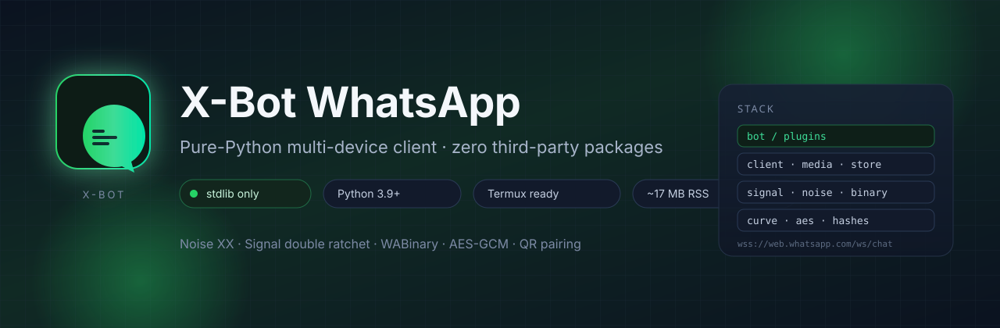
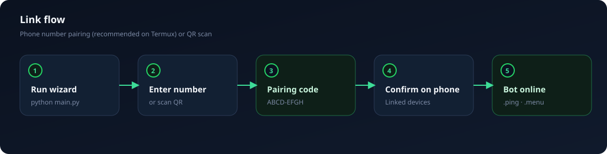
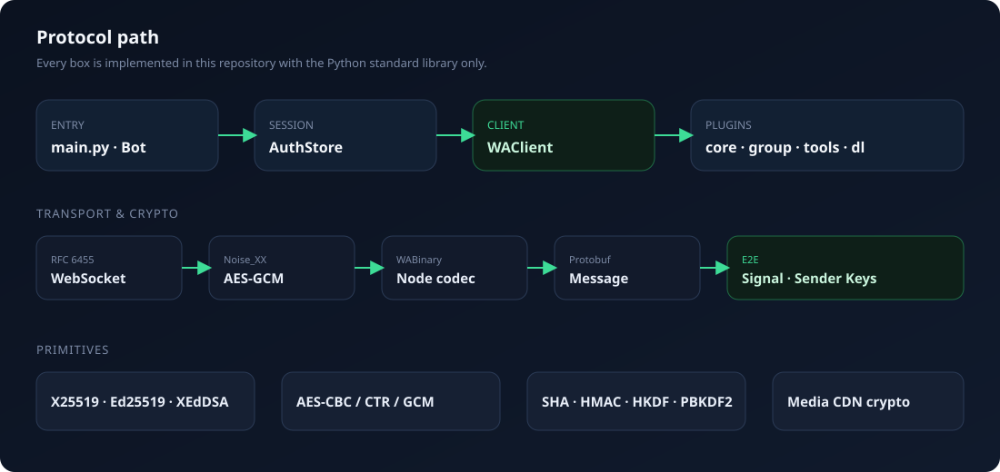

<p align="center">
  
</p>

<p align="center">
  <a href="#quick-start"></a>
  <a href="#architecture"></a>
  <a href="#tests"></a>
  <a href="#limitations--safety"></a>
</p>

<p align="center">
  <b>X-Bot</b> is a WhatsApp multi-device companion written entirely in pure Python.<br>
  Crypto, Noise, WABinary, protobuf, Signal, WebSocket, HTTP, and QR encoding ship inside this tree.<br>
  <code>pip install</code> is not required — not even for <code>requests</code>, <code>websockets</code>, <code>cryptography</code>, or <code>qrcode</code>.
</p>

---

## Contents

| | |
| :--- | :--- |
| [Highlights](#highlights) | What makes this stack different |
| [Quick start](#quick-start) | Install, link, go online |
| [Linking guide](#linking-guide) | Pairing code and QR flows |
| [Runtime](#runtime) | Background mode and CLI flags |
| [Command reference](#command-reference) | Full bot surface |
| [Configuration](#configuration) | `config.json` and group state |
| [Downloaders](#downloaders) | Media extractor endpoints |
| [Plugin SDK](#plugin-sdk) | Write your own commands |
| [Architecture](#architecture) | Protocol layers and modules |
| [Tests](#tests) | Unit and interop suites |
| [Limitations and safety](#limitations--safety) | Scope, risk, ops notes |
| [Sinhala summary](#sinhala-summary) | Short local-language guide |

---

## Highlights

<table>
  <tr>
    <td width="25%" align="center">
      <br>
      <b>Zero pip deps</b><br>
      <sub>CPython 3.9+ stdlib only</sub>
    </td>
    <td width="25%" align="center">
      <br>
      <b>Real E2E stack</b><br>
      <sub>Noise XX + Signal ratchet</sub>
    </td>
    <td width="25%" align="center">
      <br>
      <b>Phone-first</b><br>
      <sub>~17 MB RSS on 3.11</sub>
    </td>
    <td width="25%" align="center">
      <br>
      <b>Hot plugins</b><br>
      <sub>Drop-in <code>plugins/*.py</code></sub>
    </td>
  </tr>
  <tr>
    <td width="25%" align="center">
      <br>
      <b>Group ops</b><br>
      <sub>Kick, promote, antilink</sub>
    </td>
    <td width="25%" align="center">
      <br>
      <b>Media path</b><br>
      <sub>CDN encrypt / download</sub>
    </td>
    <td width="25%" align="center">
      <br>
      <b>Interop checks</b><br>
      <sub>Baileys · libsignal · jsQR</sub>
    </td>
    <td width="25%" align="center">
      <br>
      <b>Session isolation</b><br>
      <sub>Local JSON, never commit</sub>
    </td>
  </tr>
</table>

```text
  stack snapshot
  ─────────────────────────────────────────────────────────────
  transport   wss://web.whatsapp.com/ws/chat   (RFC 6455)
  handshake   Noise_XX_25519_AESGCM_SHA256
  framing     WABinary nodes  ·  protobuf Message
  e2e         X3DH · double ratchet · sender keys (skmsg)
  media       HKDF media keys · AES-CBC · HMAC-SHA256 MAC
  pairing     8-char link code  or  terminal QR (byte mode L)
  ─────────────────────────────────────────────────────────────
```

---

## Quick start

### Requirements

| Item | Notes |
| --- | --- |
| Python | **3.9+** (Termux current builds are fine) |
| Network | Outbound HTTPS / WSS to WhatsApp |
| Optional | `ffmpeg` for sticker / toimg / toaudio |

### Install

```bash
# Termux
pkg update && pkg upgrade
pkg install python
pkg install ffmpeg          # optional media conversion

# Any Linux / macOS with Python 3.9+
git clone https://github.com/sachintha82288-cpu/X-Bot-Whatsapp
cd X-Bot-Whatsapp
python main.py              # interactive setup wizard
```

There is nothing to install from PyPI. The process imports only the standard library.

### First link (60 seconds)

```bash
python main.py
```

```text
  How do you want to link?
    1)  Phone number  →  8-character code   (recommended on Termux)
    2)  QR code       →  scan with camera
```

1. Choose **1** and enter the account number with country code (`94771234567` or local `0771234567`).
2. Type the on-screen code into **WhatsApp → Linked devices → Link with phone number**.
3. Wait for the **ONLINE** banner, then send `.ping` in any chat.

Session material is written to `./session/session.json`. The next launch logs in without pairing again.

> **Security:** `session/session.json` *is* the login. Anyone with a copy can act as this linked device. It is gitignored — never commit or share it.

---

## Linking guide

<p align="center">
  
</p>

### Pairing code (CLI)

```bash
python main.py --pairing-code 94771234567
python main.py --pairing-code 0771234567      # Sri Lanka local form is accepted
```

| Detail | Value |
| --- | --- |
| Code shape | 8 Crockford characters, shown as `ABCD-EFGH` |
| Validity | Roughly one minute; the bot refreshes on timeout |
| Phone path | Settings → Linked devices → Link a device → Link with phone number |

### QR code

```bash
python main.py --qr
```

The terminal renderer packs two module rows per character cell (half-blocks + ANSI colour) so the symbol stays square on narrow phone screens. A plain ASCII fallback is used when stdout is not a TTY.

### After a successful link

| Event | What you see |
| --- | --- |
| Pair-success | Account JID saved; connection recycled by WhatsApp |
| Open | Presence published; owner inferred from the linked number if unset |
| Ready | Commands such as `.ping`, `.menu`, `.alive` respond in chat |

---

## Runtime

### Foreground

```bash
python main.py
python main.py --self --owner 94771234567
python main.py --debug
```

### Background on Termux

```bash
termux-wake-lock
nohup python main.py > bot.log 2>&1 &
tail -f bot.log
```

Prefer `tmux` or `screen` when you want an attachable session:

```bash
pkg install tmux
tmux new -s xbot
python main.py
# detach: Ctrl+B then D
```

### Command-line interface

| Flag | Purpose |
| --- | --- |
| `--pairing-code <number>` | Link with country-code number (e.g. `94771234567`) |
| `--qr` | Force QR linking; skip the wizard menu |
| `--session <dir>` | Session root (`session.json`, `config.json`, `data/`) |
| `--config <file>` | Alternate config path |
| `--owner <number>` | Primary owner (digits only) |
| `--prefix <char>` | Command prefix (default `.`) |
| `--name <text>` | Display name / push name |
| `--self` | Self mode: only the owner may run commands |
| `--debug` | Verbose protocol logging |
| `--no-banner` | Suppress the startup banner |

Reconnect uses exponential backoff (`auto_reconnect` in config). Event handlers are registered once so reconnects do not stack duplicate QR / open callbacks.

---

## Command reference

Default prefix: **`.`** — examples `.menu`, `.ping`, `.sticker`.

### Core

| Command | Aliases | Description |
| --- | --- | --- |
| `menu` | `help`, `list` | Full catalogue; `.menu <cmd>` for one entry |
| `ping` | | Round-trip latency |
| `alive` | | Uptime, RSS, Python, platform |
| `id` | `whoami` | Caller JID and chat id |
| `owner` | | Configured owner number |
| `stats` | | Message / command counters |
| `del` | `delete` | Revoke the replied-to message |

### Group administration

Requires group admin (owner bypasses). The bot must itself be an admin for most actions.

| Command | Aliases | Description |
| --- | --- | --- |
| `kick` | `remove` | Remove member (reply or @mention) |
| `add` | | Add by phone number |
| `promote` | `admin` | Grant admin |
| `demote` | `unadmin` | Revoke admin |
| `tagall` | `everyone` | Mention every participant |
| `groupinfo` | `ginfo` | Subject, size, admins |
| `invite` | | Invite link (`new` to rotate) |
| `setsubject` | | Rename group |
| `setdesc` | | Set or `clear` description |
| `leave` | | Bot leaves the group |
| `welcome` / `goodbye` | | Template + enable |
| `toggle` | `set` | `welcome`, `goodbye`, `antilink`, … |
| `antilink` | | Delete non-admin links |
| `mute` / `unmute` | `close` / `open` | Announcement mode |

### Tools

| Command | Aliases | Description |
| --- | --- | --- |
| `vv` | `viewonce` | Re-send view-once media |
| `sticker` | `s` | Image / short video → sticker (`ffmpeg`) |
| `toimg` | `toimage` | Sticker → image |
| `tts` | | Text → voice note |
| `calc` | `math` | Safe arithmetic evaluator |
| `b64` / `unb64` | `base64` / `deb64` | Encode / decode |
| `password` | `pw`, `genpw` | Random password |
| `time` | | Local date-time |
| `weather` | `wtr` | City weather summary |
| `wiki` | `wikipedia` | Wikipedia extract |
| `translate` | `tr` | Translate (inline or reply) |
| `short` | `shorturl` | URL shortener |
| `whois` | | WhatsApp existence lookup |
| `getpp` | `pp` | Profile picture |
| `afk` | | Away marker |
| `block` / `unblock` | | Contact block list (owner) |
| `broadcast` | | Fan-out to known chats (owner) |

### Downloaders

| Command | Aliases | Description |
| --- | --- | --- |
| `dl` | `download`, `url` | Direct media URL |
| `ytdl` | `yt`, `ytmp4`, `ytmp3` | YouTube via extractor API |
| `tiktok` | `tt`, `ttdl` | TikTok |
| `fbdl` | `facebook` | Facebook video |
| `igdl` | `instagram`, `ig` | Instagram |
| `twitter` | `twdl`, `x` | Twitter / X |
| `toaudio` | `tomp3` | Strip audio from video (`ffmpeg`) |

### Settings (owner)

| Command | Aliases | Description |
| --- | --- | --- |
| `prefix` | `setprefix` | Change command prefix |
| `mode` | | `public` \| `self` |
| `setname` | `botname` | Bot display name |
| `disable` / `enable` | | Gate individual commands |
| `reload` | | Reload `plugins/` |
| `sysinfo` | | Host / Python / disk / ffmpeg |

---

## Configuration

Created automatically at `session/config.json`:

```json
{
  "prefix": ".",
  "owner": "94771234567",
  "bot_name": "X-Bot",
  "mode": "public",
  "language": "en",
  "auto_reconnect": true,
  "owners": [],
  "disabled": [],
  "log_level": "info",
  "download_apis": {}
}
```

| Key | Type | Meaning |
| --- | --- | --- |
| `prefix` | string | Leading character(s) for commands |
| `owner` | string | Primary owner, digits only |
| `owners` | string[] | Additional owner numbers |
| `bot_name` | string | Menu / alive / presence name |
| `mode` | `public` \| `self` | Who may invoke commands |
| `auto_reconnect` | bool | Reconnect after drop |
| `disabled` | string[] | Hard-disabled command names |
| `log_level` | string | `trace` … `error` / `silent` |
| `download_apis` | object | Per-site extractor URL lists |

Per-group toggles (`welcome`, `goodbye`, `antilink`, …) live in `session/data/groups.json` and are mutated by the group commands themselves.

---

## Downloaders

Social extractors are pluggable HTTP endpoints. WhatsApp only ever sees the final media URL the bot uploads to the official CDN.

```json
{
  "download_apis": {
    "youtube":   ["https://your-api.example/api/yt?url={url}"],
    "tiktok":    ["https://your-api.example/api/tiktok?url={url}"],
    "facebook":  ["https://your-api.example/api/fb?url={url}"],
    "instagram": ["https://your-api.example/api/ig?url={url}"],
    "twitter":   ["https://your-api.example/api/twitter?url={url}"]
  }
}
```

| Rule | Detail |
| --- | --- |
| Placeholders | `{url}` percent-encoded link; `{id}` YouTube video id |
| Failover | Arrays are tried in order until one returns media |
| JSON walk | First `http(s)` under keys such as `url`, `link`, `download`, `play`, `hd`, `mp4`, `mp3`, `nowm`, … |
| Direct fetch | `.dl <url>` needs no extractor; type is guessed from `Content-Type` |
| Size cap | Downloads refuse payloads above **48 MB** |

Media bytes are encrypted with the WhatsApp media HKDF schedule (AES-CBC + trailing MAC) before CDN upload — no third-party file host is involved.

---

## Plugin SDK

Every `plugins/*.py` file loads at startup and again on owner `.reload`.

```python
from xbot.bot.plugin import command, on_message

@command("hello", help="say hello", aliases=["hi"], category="custom")
def hello(bot, message, args):
    # Returning a string sends a quoted reply.
    return "hello " + (" ".join(args) or message.push_name or "there")
```

### Decorator options

| Option | Effect |
| --- | --- |
| `name` | Canonical command name |
| `help` | Menu blurb |
| `aliases` | Extra trigger names |
| `category` | Menu grouping |
| `hidden` | Omit from `.menu` |
| `owner_only` | Owner gate |
| `admin_only` | Group-admin gate |
| `group_only` | Refuse DMs |

### Handler surface

| API | Role |
| --- | --- |
| `bot.client` | `send_text`, `send_image`, `send_video`, `send_audio`, `send_document`, `send_sticker`, `send_reaction`, `profile_picture_url`, `block_contact`, … |
| `bot.config` | Live `config.json` values |
| `bot.group_settings` | Per-group toggles |
| `bot.is_admin(group, jid)` | Admin probe |
| `bot.download_media(message)` | Decrypted media bytes |
| `bot.log` | Logger |
| `message.reply` / `send` / `react` | Outbound helpers |
| `message.text`, `.chat`, `.sender`, `.mentions`, `.quoted`, `.media_type` | Inbound fields |

Hooks: `@on_message`, `@on_join`, `@on_leave`, `@on_call`. See `plugins/example.py` for a minimal template.

---

## Architecture

<p align="center">
  
</p>

### Package map

| Module | Responsibility |
| --- | --- |
| `xbot/crypto/hashes.py` | SHA-1/256/512, HMAC, HKDF, PBKDF2 (stdlib acceleration available) |
| `xbot/crypto/aes.py` | AES-128/256 in CBC, CTR, GCM (+ GHASH) |
| `xbot/crypto/curve.py` | X25519, Ed25519, XEdDSA |
| `xbot/wa/tokens.py` | Dictionary tokens and packed nibble/hex rules |
| `xbot/wa/binary.py` | WABinary encoder/decoder, JIDs, zlib frames |
| `xbot/wa/protoschema.py` | Generated WhatsApp protobuf schema |
| `xbot/wa/protobuf.py` | Compact reader/writer (varints, packed, nested) |
| `xbot/wa/ws.py` | RFC 6455 client (masking, ping/pong, fragments) |
| `xbot/wa/noise.py` | Noise XX with WhatsApp certificate chain |
| `xbot/wa/signal.py` | X3DH, double ratchet, sender keys, pre-keys |
| `xbot/media.py` | Media key schedule, upload/download to CDN |
| `xbot/store.py` | Atomic JSON session (identity, sessions, devices) |
| `xbot/client.py` | Login, pairing, send/recv, receipts, groups |
| `xbot/bot/` | Plugin registry, `Message`, runtime, QR encoder |
| `main.py` | Wizard, CLI, reconnect loop |

### Wire path

```text
  phone / peer
       │
       ▼
  wss://web.whatsapp.com/ws/chat
       │  RFC 6455 frames
       ▼
  Noise XX  (AES-GCM transport keys)
       │  length-prefixed frames
       ▼
  WABinary nodes  ── iq / message / receipt / notification
       │
       ▼
  protobuf Message
       │
       ├── pkmsg / msg     → Signal session cipher
       └── skmsg           → group sender keys (+ SKDM fan-out)
```

---

## Tests

All checks are offline. No third-party Python test framework is required.

```bash
python3 tools/run_all_checks.py
```

| Suite | Proves |
| --- | --- |
| `tests/test_bot.py` | Runtime, parsing, plugins (fake client) |
| `tools/interop/check_binary.py` | Byte-identical WABinary vs Baileys |
| `tools/interop/check_proto.py` | Protobuf codec vs schema vectors |
| `tools/interop/check_signal.py` | X3DH + ratchet + sender keys vs libsignal |
| `tools/interop/check_qr.py` | jsQR decodes every matrix; terminal round-trip |
| `tools/interop/check_client.py` | Full login against mock server; encrypt + decrypt |

```bash
# Unit only (Python)
python3 tests/test_bot.py

# Interop needs Node + deps once
cd tools/interop && npm install && cd ../..
python3 tools/run_all_checks.py
```

---

## Limitations and safety

| Topic | Detail |
| --- | --- |
| ToS | Unofficial multi-device client. Using it can get the account banned. Use a disposable number; do not spam. |
| Scope | Linked-device capabilities only. Business catalogues / message templates are not implemented. |
| Calls / status | Voice and video calls, live location, and status stories are incomplete. |
| Admin rights | Group moderation requires the bot to be a group admin. |
| ffmpeg | `sticker`, `toimg`, `toaudio` shell out to Termux `ffmpeg`; other commands work without it. |
| Memory | Single process, small thread pool. Media is buffered while encrypting; `.dl` caps at 48 MB. |
| Hardening | Prefer `mode: "self"` or `python main.py --self` on personal accounts. Guard `session/session.json`. |

```text
  operational checklist
  ──────────────────────────────────────────
  [ ] disposable WhatsApp number
  [ ] session/ excluded from git and backups you share
  [ ] owner set (wizard does this when pairing)
  [ ] self mode if the bot must not serve strangers
  [ ] termux-wake-lock or tmux for unattended runs
  ──────────────────────────────────────────
```

---

## Sinhala summary

| පියවර | විස්තරය |
| --- | --- |
| 1 | Termux: `pkg install python` |
| 2 | `git clone …` → `cd X-Bot-Whatsapp` → `python main.py` |
| 3 | Wizard එකේ **1** තෝරලා අංකය දෙන්න (`9477…` හෝ `07…`) |
| 4 | Terminal code එක WhatsApp → Linked devices → Link with phone number |
| 5 | ONLINE ආවම `.ping` / `.menu` |
| QR | `python main.py` → **2**, හෝ `python main.py --qr` |

`session/session.json` ගොනුව රහසිගතව තබන්න — එය WhatsApp login එකයි.

---

## License and attribution

Protocol behaviour follows the public multi-device design used by linked WhatsApp clients. Cryptographic and codec modules in this repository are original pure-Python implementations for study and personal automation.

<p align="center">
  
  &nbsp;
  
  &nbsp;
  
  &nbsp;
  <sub>X-Bot · pure Python · stdlib only</sub>
</p>
